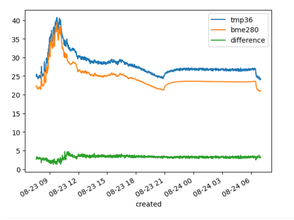
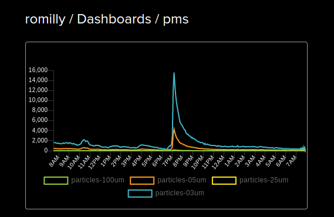

# Environmentla Monitoring with Raspebrry Pi Pico and MQTT

This started out as a project to explore the data returned by two Pico-based home-brewed environmental monitors,
but I'm extending it to cover the Adafruit PMS300i particulate sensor. Later I may add the Pimoroni Enviro Urban.

## Compare temperature readings from different sensors

I've been recording temperature data from a TMP36 temperature sensor
and a home-brew weather station, implemented in MicroPython running on two Raspberry Pi Pico W boards.

The weather station includes a light level sensor and a
BME280 which measures temperature, pressure and humidity.

Both devices use MQTT to transmit their readings to [Adafruit.IO](https://io.adafruit.com/).
The code they run is on [GitHub](https://github.com/romilly/pico-code/tree/master/src/pico_code/picow).

The temperature readings differ more than I'd expected, and I'm using Pandas to analyse the downloaded data.

The high-level analysis is done using a Jupyter notebook.
The preparation of the csv files is done by `plot_temperatures.py`

_Warning:_ I'm a novice user of Pandas, and there may be better ways of manipulation the data.

## Sample plot

The sensors are indoors just inside a window which is normally open during the day but closed at night.

The rapid exponential rise at 10 Pm and fall at 5:54 AM are due to the closing and opening of the window.

The peak at 11 AM is due to sunlight falling on both sensors.

## The Particulate Sensor.

The readings I've been capturing from this are surprising, but I think I know what's going on.

### The story of the peaks

Looking at this and other plots, I think I've worked out the origins of the large and smaller peaks in
particulate levels.

The pms sensor is located in my study, which is linked to our kitchen by a very short corridor.

Like most of the rooms in our flat the has a study has a radiator.

We're only using our central heating for short periods when showering on very cold mornings.

The big peaks coincide with frying in the kitchen.

Smaller peaks are mostly due to my arrival in the study and to bursts of central heating.

I've made the data [dashboard](https://io.adafruit.com/romilly/dashboards/pms) public.

I'll blog in another post about the code that's capturing the data.
It's on [GitHub](https://github.com/romilly/pico-code), along with a lot of other code for
the Raspberry Pi Pico/PicoW.